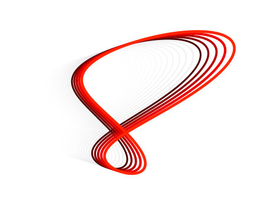

# Sundials, Orbits and Analemmas

<style>
  .center {
  display: block;
  margin-left: auto;
  margin-right: auto;
  }
</style>



`analemma` performs sundial calculations, allowing for very general geometry that covers all common types of dial. Highlights include

 * exact parametric expressions for the analemma on any type of sundial
 * orbits and the equation of time for any planet
 * a plotting module to draw the analemma
 * all results expressed numerically and in symbolic algebra
 * all tests published within the package so you can read and run them

## Install

```bash
pip install analemma
```

## Usage

```python
import matplotlib.pyplot as plt
from analemma import orbit, plot as aplot, geometry as geom

earth = orbit.PlanetParameters.earth()
vertical_dial = geom.DialParameters.vertical(latitude=52.5) # Cambridge, UK

fig, ax = plt.subplots()
ax.grid()
ax.axis("equal")

aplot.plot_hourly_analemmas(ax, earth, vertical_dial)
```

See [Analemma Plots](nb/sundial_plots.md) for complete examples showing various analemmas.

For the connection between the angle of the sun, the date, and the time, see [The Equation of
Time](nb/equation_of_time.md), [Sunrise and Sunset](nb/sunrise_and_sunset.md), and [Orbit Analysis](nb/orbit_analysis.md).

## The Mathematics of Sundials and the Analemma

The analemma is the path traced by the shadow on a sundial (or the sun in the sky) when observed at the same time each day throughout one year. In this package, the analemma is expressed in an exact parametric expression whose derivation was first presented in 2006. See the [project homepage](https://russellgoyder.github.io/sundial-latex/) for more information.

`analemma` uses [SymPy](https://www.sympy.org/en/index.html) and [GAlgebra](https://github.com/pygae/galgebra) to encode and present the mathematics of the analemma in a series of notebooks:

 * [Setup and Definitions](nb/sundial_setup.md) covers the geometry, location and orientation of the gnomon
   (shadow-casting stick) and face of the sundial.
 * [The Hour Angle](nb/hour_angle.md) derives a generalized formula for the solar hour angle, defined
   as the angle between the face of the dial and the plane containing the sun ray and the gnomon.
 * [The Shadow Angle](nb/shadow_angle.md) calculates unit vector parallel to the shadow and how it moves in time
 * [The Shadow Length](nb/shadow_length.md) finds the length of the shadow
 * [The Analemma](nb/analemma.md) presents a parametric expression for the analemma as the coordinates of the tip of a sundial's shadow
 * [Comparison with Rohr's book](nb/rohr_comparison.md) performs a comparison with known results from a standard text


## Project Links

 * [Homepage](https://russellgoyder.github.io/sundial-latex/)
 * [Repository](https://github.com/russellgoyder/sundial)
